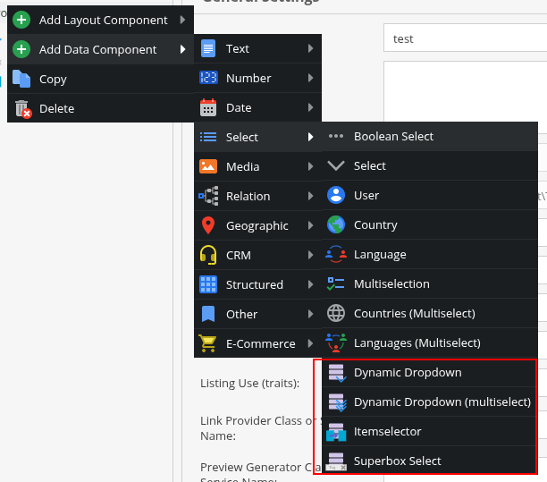
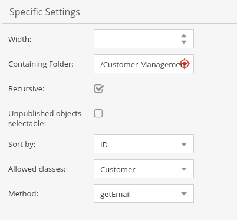
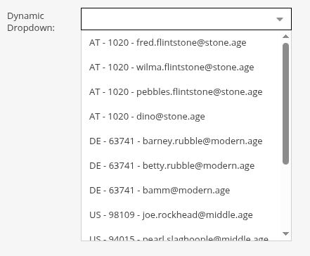
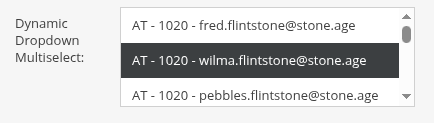
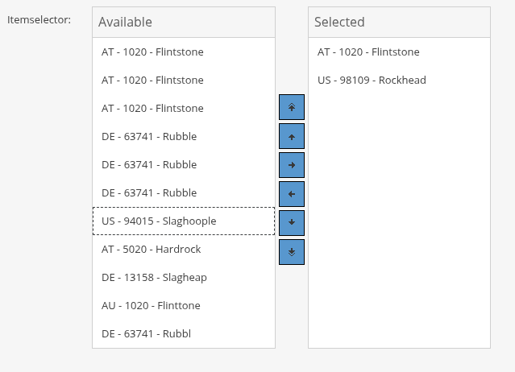
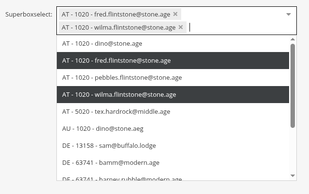

# Weblizards Dynamic Dropdown Bundle

Dynamic Dropdown allows you to dynamically populate pimcore input fields with the content of other objcts.
Internaly it works like a `manyToManyRelation` but provides advanced UI elements, the content thus is truly dynamic.

## Installation

```bash
composer require weblizards/dynamic-dropdown-bundle
```

Activate the bundle in Pimcore by adding this line in `config/bundles.php`:

```php
return [
    // ...
    \Weblizards\DynamicDropdownBundle\WeblizardsDynamicDropdownBundle::class => ['all' => true],
];
```

Install the assets:
```bash
bin/console assets:install # --symlink --relative
```

## Usage

The plugin extends pimcores class data compent menu in the section "Select". 

Four new elements can be used:



* Dynamic Dropdown:  a single select dropdown menu
* Dynamic Dropdown (multiselect): a box with several items to select. 
  Select one by clicking it, all other will be deselected. Hold the CTRL-key while 
  clicking to add the item without deselecting the others.
* Itemselector: the items are displayed in two columns, on the left are the available 
  (or remaining) items, on the right are the selected ones. Transfer to the other column 
  by doubleclicking or using the left/right arrow button. Up/down arrow buttons arrange the order.
* Superbox Select: Like a "tag field". Select one item and it get's displayed, click the little "x" next to it to

## Options
The options for all input elements are the same, only the way the information is presented differes.



Following options need to be set:

* `Width`: the width of input element
* `Containing Folder`: the path to the folder containing the source objects. You can use drag&drop
* `Recursive`: check this if objects in subfolders shall be used as well
* `Unpublished objects selectable`: usually unpublished objects will be displayed in the item list, but be of a grey color and unselectable. Check this if you want unpublished objects to be selectable. This option is currently only used by the single select dropdown!
* `Sort by`: either "Value" or "Id". By value is alphabetically ascending, by Id is numerically ascending by pimcore's object id.
* `Allowed classes`: the object class, that provides the data. Only objects of this class we be considered, all others will be ignored.
* `Method`: the method that provides the data. The possible methods are extracted from the class definition of the source class.

## Input Fields

### Dynamic Dropdown


The Dynamic Dropdown is the "classic" version of the provided input elements: a dropdown input field
(ExtJS: Combobox). Every option is provided by an object in a configured folder, by a configured method.
The folder can have nested subfolders, but only one type of object class can provide the data.

This input element extends pimcore's [href]([manyToOneRelation](https://docs.pimcore.com/pimcore/10.6/Development_Documentation/Objects/Object_Classes/Data_Types/Relation_Types.html#page_Many-To-One-Many-To-Many-and-Many-To-Many-Object-Relation-Data-Fields)) element.
Programmatically, you can set its value with the API like you'd do with a `manyToOneRelation`.

### Dynamic Dropdown (multiselect)


The multiselect Dynamic Dropdown is like the single select version, but you can select more than one item.
It uses ExtJS' UX MultiSelect. It extends pimcore's [manyToManyRelation](https://docs.pimcore.com/pimcore/10.6/Development_Documentation/Objects/Object_Classes/Data_Types/Relation_Types.html#page_Many-To-One-Many-To-Many-and-Many-To-Many-Object-Relation-Data-Fields). 
Setting it with the API is like working with a `manyToManyRelation`

### Itemselector


The Itemselector is like the Multiselect, but uses the ItemSelector as UI element.

### SuperboxSelect


The SuperboxSelect is like the Multiselect, but uses the TagField as UI element.

### Example

```php
use Pimcore\Model\Object;

$myHrefElement = Document::getById(23);
$myOtherHrefElement = Document::getById(23);

$myMultihrefElements[] = $myHrefElement;
$myMultihrefElements[] = $myOtherHrefElement;

$myObjectsElements[] = DataObject\Product::getById(98);
$myObjectsElements[] = DataObject\Product::getById(99);

$object->setDynamicDropdown($myHrefElement);
$object->setDynamicDropdownMultiple($myMultihrefElements);
$object->setItemselector($myMultihrefElements);
$object->setSuperboxSelect($myMultihrefElements);

$object->save();
```